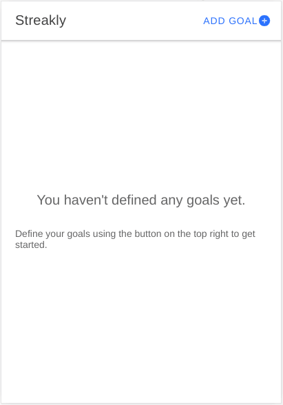

# streakly

With streakly, you can easily define your very own weekly goals and keep track if your reached them. 

For the extra motivation the number of weeks your reached your goals in a row is displayed.



## Development

Make sure you have nodeJs installed.

Install ionic CLI:

```
npm install -g @ionic/cli
```

For running the development server, run

```
ionic serve
```


## Build and deploy for Android

You need to install and setup Android Studio and the Android SDK as described in the [ionic documentation](https://ionicframework.com/docs/developing/android)

The following steps will build the application for Android:

```
ionic build
ionic cap add android
```

After each change on the application, you need to copy those to the android project:
```
ionic cap copy
```

If everything is setup correctly, you can open the Android project with Android Studio by 
```
ionic cap open android
```
Use the Run button to deploy the application to your mobile. 
